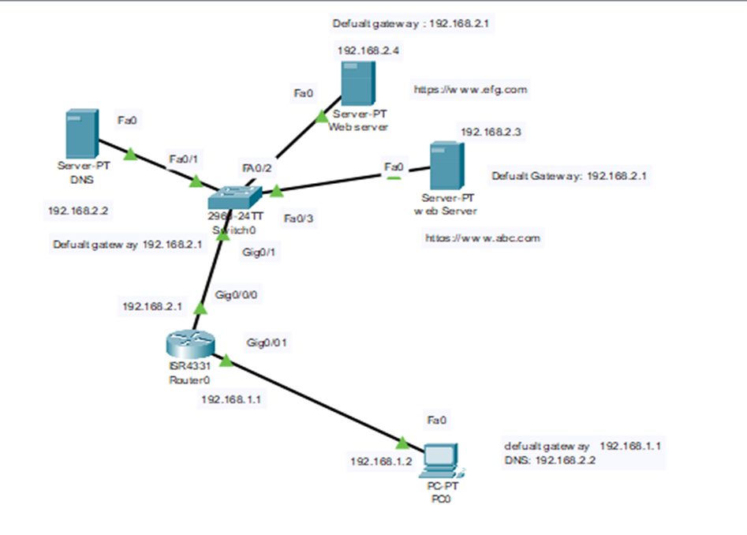
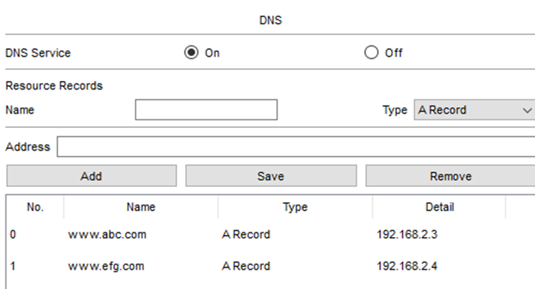
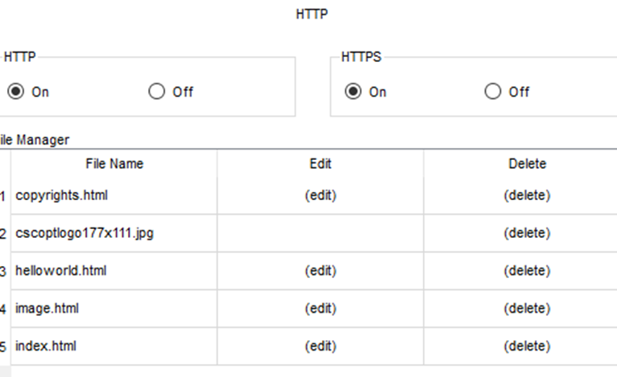
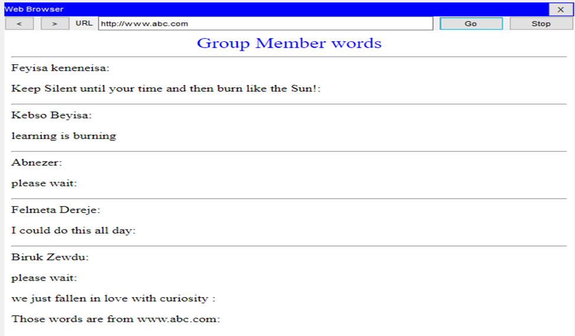

# dns-config

DNS Configuration
To configure DNS and test domain name-IP resolution network topology on figure below was used

 
Used Components
Cisco packet tracer v8.2.2
Component Name	Quantity
Pc (desktop)	1
Router	1
Switch	1
DNS server	1
Web server	2

Addressing table
Every IP assignment was statical
Device	Interface	IPV4	Subnet mask	Default Gateway	DNS
Pc0	Fa0	192.168.1.2	255.255.255.0	192.168.1.1	192.168.2.2
Router0	Gig0/0/1	192.168.1.1	255.255.255.0	------------	-----------
Router0	Gig0/0/0	192.168.2.1	255.255.255.0	-------------	-----------
DNS server	Fa0/1	192.168.2.2	255.255.255.0	192.168.2.1	-----------
Web server(www.efg.com)	Fa0	192.168.2.4	255.255.255.0	192.168.2.1	-----------
Web server (www.abc.com)	Fa0	192.168.2.3	255.255.255.0	192.168.2.1	-----------

Enabling Services on Each Servers
After assigning IPv4 to each layer 3 three devices the necessary services on each server were enabled.
•	DNS Server: on DNS server DNS service was enabled and then resources with IP addresses of each web server and their corresponding domain name were recorded on in it.
 

•	Web servers: on both web servers HTTP service was enable and content index.html files were updated for testing purpose later on.  

Testing Connectivity Using Domain Names
•	Ping test  
	From pc0 web server with domain name www.abc.comwas pinged and it was successful

C:\>ping www.abc.com

Pinging 192.168.2.3 with 32 bytes of data:

Reply from 192.168.2.3: bytes=32 time<1ms TTL=127
Reply from 192.168.2.3: bytes=32 time<1ms TTL=127
Reply from 192.168.2.3: bytes=32 time<1ms TTL=127
Reply from 192.168.2.3: bytes=32 time<1ms TTL=127

Ping statistics for 192.168.2.3:
Packets: Sent = 4, Received = 4, Lost = 0 (0% loss),
Approximate round trip times in milli-seconds:
Minimum = 0ms, Maximum = 0ms, Average = 0ms

C:\>ping www.efg.com

Pinging 192.168.2.4 with 32 bytes of data:

Reply from 192.168.2.4: bytes=32 time<1ms TTL=127
Reply from 192.168.2.4: bytes=32 time<1ms TTL=127
Reply from 192.168.2.4: bytes=32 time<1ms TTL=127
Reply from 192.168.2.4: bytes=32 time<1ms TTL=127

Ping statistics for 192.168.2.4:
Packets: Sent = 4, Received = 4, Lost = 0 (0% loss),
Approximate round trip times in milli-seconds:
Minimum = 0ms, Maximum = 0ms, Average = 0ms

	Similarly, from pc0 web server with domain name www.efg.com  was pinged and it was successful 
•	Web Browse Test

	On the compilation of ping test another connectivity was also tested using web browser. Here the below were browsing results using domain name of each web servers.

 
 
